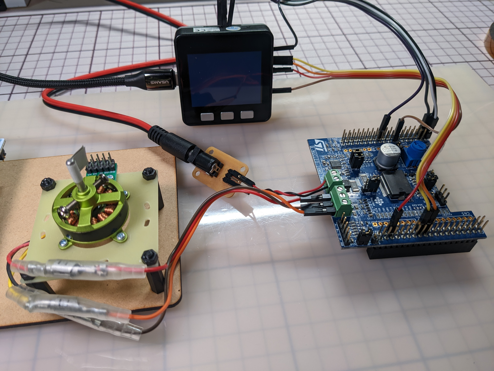

# M5Stack_MotorDrive

## About

M5StackとSTマイクロのモータドライバを使用した、3相ブラシレスモータの駆動  
Driving a 3-phase BLDC motor using M5Stack and an ST Micro motor driver X-NUCLEO-IHM07M1.

---

## Detail

### Overview

---

### Parts

- M5Stack Grey
- X-NUCLEO-IHM07M1
- 3-phase BLDC motor

---

### DataSheet

---

### Pin Assign

 |                 |     | M5Stack Pin | IHM07M1 Pin |
 | :-------------: | :-: | :-: | :-: |
 | Drive IC Power  |     | 3V3 | C7_16 |
 | GND             |     | GND | C7_20 |
 | Enable (OUTPUT) | U   | 21  | C7_1 |
 |                 | V   | 22  | C7_2 |
 |                 | W   | 16  | C7_3 |
 | PWM (OUTPUT)    | U   | 2   | C10_23 |
 |                 | V   | 5   | C10_21 |
 |                 | W   | 26  | C10_33 |
 | Hall IC (INPUT) | U   | 17  | J3_1 |
 |                 | V   | 35  | J3_2 |
 |                 | W   | 36  | J3_3 |
 |                 | 5V  | -   | J3_4 |
 |                 | GND | -   | J3_5 |
 |||||

---

## Author

@HelicalEngineer  
[Twitter](https://twitter.com/HelicalEngineer "Twitter")  
[WebSite](https://helical-engineer.com/ "WebSite")  
